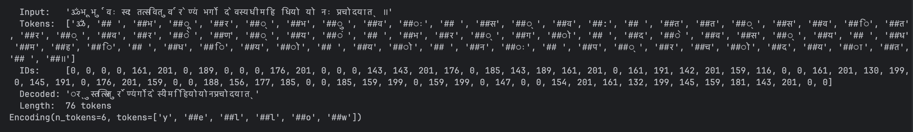
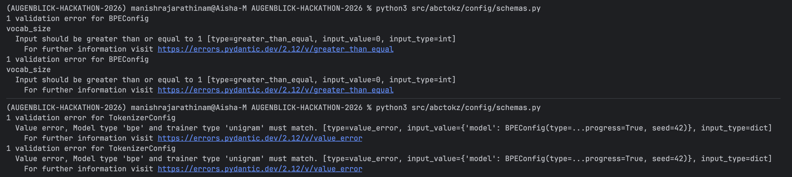

# Solutions to Tasks

### TASK 1

### Question :

Take this Sanskrit mantra:

ॐ भूर्भुवः स्व: तत्सवितुर्वरेण्यं भर्गो देवस्य धीमहि धियो यो नः प्रचोदयात् ॥

Pick one model (BPE is a good choice), train it on a small corpus, and encode this string. Then trace what actually
happened — from the moment you called encode() all the way to the final list of token IDs.

What we're looking for:

    Which files and classes were involved at each stage?
    What did the normalizer do to the string before the model saw it?
    What did the pre-tokenizer do after normalization?
    How did the model turn pre-tokens into subword pieces?
    How were those pieces turned back into a string during decode()?

### ANSWER:

***background:***

spent HOURS understanding how llms work, stages of tokenization and general knowledge to even read this project's README

***Understanding the context:***

Very generously, within the examples folder we have ready to run code samples including that of bpe,

THE CORPUS IS GIVEN
observation about the corpus: for the given text to encode with is in sanskrit, the corpus has only few
lines of sanskrit text.

so umm yeah wild ride for the text to get encoded.

ill paste the output first, and then try my best to explain what happened



***Files modified for the output:***

added the input line within examples/train_bpe.py files
line 65 to be precise

Explanation:

straight of the bat, we can see the input line is itself messed up, this is a pycharm, vscode terminal issue where the
support for foreign languages arent supported.

1. *Which files and classes were involved at each stage?*

the train_bpe.py and encode() & decode() function is written in tokenizer.py
additionally a temporary ghost "corpus" is created for the script to run containing all the corpus*30 and then deleted
automatically after the script is run (pretty nice automation that)

the code block for encoder function:

(line 93)

```python
 def encode(self, text: str) -> Encoding:
        """Encode *text* into an :class:`~abctokz.types.Encoding`.

        The full pipeline is applied: normalization → pre-tokenization
        → model tokenization → post-processing.

        Args:
            text: Raw input string.

        Returns:
            :class:`~abctokz.types.Encoding` with ids, tokens, and offsets.
        """
``` 

2. *What did the normalizer do to the string before the model saw it?*

in this specific line of encoder function implemention

```python
        normalized = self._normalizer.normalize(text) if self._normalizer else text
```

It checks if a normalizer is attached to this tokenizer instance. If so, it passes the raw text through it (e.g.,
lowercasing it). If not, it just passes the raw text through untouched

if a normalizer exists, te rest of function operates on the variable *normalized* and not the original text

3. *What did the pre-tokenizer do after normalization?*

in the specific line of encoder function

```python
        if self._pretokenizer:
            pre_tokens = self._pretokenizer.pre_tokenize(normalized)
        else:
            pre_tokens = [normalized]
```

does really the same thing as the normalizer block, checks if a instance of pretokenizer is attacked, if not you can see
it just directly puts the normalized text in a list, untouched

else it pre tokenizes it

### OPTIMIZATION SUGGESTION

*maybe if we can run a custom pretokenize script instead of skipping the pretokenization process if there is no custom
pre tokenizer?*

4. How did the model turn pre-tokens into subword pieces?

it does this in the 3rd stage, the tokenization process

```python
        cursor = 0
        for pre_tok in pre_tokens:
            # Find the offset of this pre_token in the normalized string
            start_pos = normalized.find(pre_tok, cursor)
            if start_pos == -1:
                start_pos = cursor

            pairs = self._model.tokenize(pre_tok)
            char_offset = start_pos
            for tok_str, tok_id in pairs:
                tok_len = len(tok_str.lstrip("##"))  # strip continuation prefix for offset
                ids.append(tok_id)
                tokens.append(tok_str)
                offsets.append((char_offset, char_offset + len(pre_tok)))
                is_special = int(tok_str in self._special_tokens)
                special_mask.append(is_special)
                attention_mask.append(1)

            cursor = start_pos + len(pre_tok)
```

here it iterates through every sub token in the pre_token list, and it runs the bpe algorithm for every word,
appending "##" and its unique id for every token.

5. How were those pieces turned back into a string during decode()?

yet to do

### Task 2 — Who Does What? Mapping Module Responsibilities

The architecture is actually pretty standard for a modern Python library—everything is strictly separated, with a few
weird exceptions. Here is how the responsibilities map out.

**1. Module Responsibility Mapping**

* **Training a tokenizer (learning vocabulary from text):** All the heavy lifting for crunching a corpus and building a
  vocabulary happens in `src/abctokz/trainers/`. If you look inside, you'll see specific scripts like bpe_trainer.py and
  unigram_trainer.py that handle the actual statistical learning.

* **Using a trained tokenizer to encode new text:** This is a two-part job. The main one is `src/abctokz/tokenizer.py` (
  the core orchestrator). It takes the string and routes it through the pipeline, but the actual math and subword
  extraction is outsourced to the engines living inside `src/abctokz/models/` (which holds the logic for BPE, Unigram,
  and WordLevel).

* **Saving and loading a tokenizer to/from disk:** Surprisingly, this isn't given to a dedicated storage service. It is
  implemented directly inside `src/abctokz/tokenizer.py` using the save() and load() methods on the main tokenizer
  class, which personally is not what I admire.

* **Measuring tokenizer quality (fertility, UNK rate, etc.):** Everything related to grading the model lives in the
  `src/abctokz/eval/` directory. Specifically, metrics.py handles scores (like counting unknown tokens), while
  benchmark.py is dedicated to measuring system throughput and latency.

* **Comparing abctokz against external tokenizers:** This is heavily isolated inside `src/abctokz/adapters/`, which
  contains dedicated wrapper scripts like hf.py (for Hugging Face) and sentencepiece.py (for Google's SentencePiece).

**2. A Clean Module Boundary**

What I really loved finding in this codebase was how they handled external dependencies—specifically the *
*`src/abctokz/adapters/`** module.

**Why it is satisfyingly clean:** External machine learning libraries like HuggingFace’s `transformers` or Google’s
`sentencepiece` are absolutely large. They carry massive, heavy dependencies. The architects of this repo were smart
enough to lock all of that code entirely inside the `adapters/` folder.

If we look at the import trees, the core `tokenizer.py` orchestrator and the `models/` directory *never* import anything
from `adapters/`. It acts as a strict Anti-Corruption Layer. In practice, this means if a standard user just wants to
run this tokenizer locally, they aren't forced to download gigabytes of third-party ML libraries just to get the code to
compile, which is what I liked very much.

**3. A Blurry or Inconsistent Module Boundary**

On the flip side, the boundary feels highly inconsistent and blurry within **`src/abctokz/tokenizer.py`**—specifically
when you look at how the `save()` and `load()` methods are written.

**Why it feels blurry:** The `AugenblickTokenizer` class is clearly designed to be a high-level text processing
orchestrator. Its whole job is to route strings through Normalization → Pre-tokenization → Model.
However, when you scroll down to its `save()` method, it suddenly starts doing low-level file system operations. It's
actively creating directories (`mkdir`), manually calculating SHA256 checksums, and building raw JSON manifests from
scratch. It violently mixes core text-transformation logic with direct hard-drive I/O operations, which is a classic
violation of the Single Responsibility Principle. It makes the orchestrator a "Fat Controller."

```python
def save(self, path: str) -> None:
        out = ensure_dir(path)
        self._model.save(str(out))

        st_data = {k: v.to_dict() for k, v in self._special_tokens.items()}
        save_json(st_data, out / SPECIAL_TOKENS_FILENAME)

        model_type = self._infer_model_type()
        config_data: dict[str, object] = {"model_type": model_type, "schema_version": SCHEMA_VERSION}
        save_json(config_data, out / CONFIG_FILENAME)

        vocab_size = self._model.get_vocab_size()
        checksum = ""
        vocab_path = out / "vocab.json"
        if vocab_path.exists():
            checksum = sha256_file(vocab_path)

        metadata = ArtifactMetadata(
            schema_version=SCHEMA_VERSION,
            model_type=model_type,
            vocab_size=vocab_size,
            created_at=datetime.datetime.utcnow().isoformat() + "Z",
            checksum=checksum,
        )
        save_json(metadata.to_dict(), out / MANIFEST_FILENAME)
        logger.info("Tokenizer saved to %s (vocab_size=%d)", path, vocab_size)
```

**What I would do about it:** I wouldn't tear up the repo to create a brand new architecture. I would just respect the
current setup and move this messy saving logic into the already-existing `src/abctokz/vocab/serialization.py` file, or
just append it to the helper functions in `src/abctokz/utils/io.py`.

The `AugenblickTokenizer` class shouldn't have to care about how or where its files are saved to a hard drive; it should
just blindly pass its state to an external save function and let the I/O module handle the JSON dumping.

### Task 3 — The National Anthem Test

**Approach**

The experiment uses the existing `abctokz` BPE pipeline, no new code was written. The full script is at [
`examples/task3_national_anthem.py`](examples/task3_national_anthem.py).

**Step-by-step**

1. Build a small training corpus containing both English transliteration and Devanagari lines of Jana Gana Mana (first
   stanza), plus a few supplementary Hindi/Marathi lines. Each line is repeated 50× so word frequencies exceed the
   default `min_frequency=2` threshold in `BPETrainerConfig`.
2. Create a `bpe_multilingual(vocab_size=500)` config defined in `src/abctokz/config/defaults.py`. This wires together:
    - `multilingual_shared_normalizer()` (NFC Unicode normalization + whitespace collapse)
    - `DevanagariAwarePreTokenizer` (splits on script boundaries, not just spaces)
    - `BPEModel` + `BPETrainer`
3. Instantiate `Tokenizer.from_config(config)` and call `tokenizer.train([corpus_path], config)`.
4. Encode the two test sentences and call `fertility()` from `src/abctokz/eval/metrics.py`.
5. Pass the same strings through `tiktoken.encoding_for_model("gpt-4")` and compare.

**Test sentences**

|                         | Text                                                                     |
|-------------------------|--------------------------------------------------------------------------|
| English transliteration | `Jana Gana Mana Adhinayaka Jaya He Bharata Bhagya Vidhata Punjab Sindhu` |
| Devanagari              | `जन गण मन अधिनायक जय हे भारत भाग्य विधाता पंजाब सिंधु`                   |

Both sentences have **11 whitespace-separated words**.

**Results — abctokz BPE (vocab size trained: 333 / requested: 500)**

```
── English transliteration ──
	Input : Jana Gana Mana Adhinayaka Jaya He Bharata Bhagya Vidhata Punjab Sindhu
	Tokens (38): ['J', '##an', '##a', 'G', '##an', '##a', 'M', '##an', '##a','A', '##dh', '##in', '##a', '##ya', '##ka', 'Ja', '##ya', 'He','B', '##ha', '##ra', '##ta', 'B', '##ha', '##g', '##ya','V', '##id', '##ha', '##ta', 'P', '##un', '##ja', '##b','S', '##in', '##dh', '##u']

	IDs  : [228, 15, 1, 220, 15, 1, 236, 15, 1, 211, 30, 56, 1, 92, 63, 234, 92,226, 214, 44, 77, 82, 214, 44, 35, 92, 254, 54, 44, 82, 242, 88, 60,19, 244, 56, 30, 85]

── Devanagari ──
	Input : जन गण मन अधिनायक जय हे भारत भाग्य विधाता पंजाब सिंधु
	Tokens (26): ['जन', 'गण', 'मन', 'अ', '##धि', '##ना', '##य', '##क', 'जय','हे', 'भा', '##रत', 'भा', '##ग', '##्य', 'वि', '##धा', '##ता','प', '##ंज', '##ा', '##ब', 'स', '##ि', '##ंध', '##ु']
	IDs  : [281, 275, 312, 264, 145, 151, 165, 103, 282, 331, 308, 173, 308, 112,209, 322, 144, 134, 297, 101, 189, 154, 325, 194, 102, 197]
```

**Fertility scores**

| Script                                     | Tokens | Words | Fertility (tokens ÷ words) |
|--------------------------------------------|--------|-------|----------------------------|
| English transliteration (abctokz)          | 38     | 11    | **3.455**                  |
| Devanagari (abctokz)                       | 26     | 11    | **2.364**                  |
| English transliteration (GPT-4 / tiktoken) | 23     | 11    | **2.091**                  |
| Devanagari (GPT-4 / tiktoken)              | 54     | 11    | **4.909**                  |

**Why the numbers differ**

*abctokz English > abctokz Devanagari (3.455 vs 2.364)*

The model was trained on a Devanagari-rich corpus, so the BPE merger rules learned longer Devanagari subword units (e.g.
`जन`, `गण`, `मन` appear as single tokens). English transliteration, by contrast, appears in fewer training examples
meaning fewer high-frequency character n-grams were merged, leaving many single-character pieces (`J`, `G`, `M`, …) with
`##` continuations.

The `DevanagariAwarePreTokenizer` (see `src/abctokz/pretokenizers/devanagari_aware.py`) also plays a role: it splits on
script boundaries, ensuring Devanagari characters are never mixed with Latin characters in a single pre-token, giving
the BPE trainer clean Devanagari units to learn merge rules on.

*tiktoken English < tiktoken Devanagari (2.091 vs 4.909)*

This is the exact opposite pattern. GPT-4's tokenizer was trained on a corpus overwhelmingly dominated by Latin-script
text, so it has large English vocabulary entries and merges English words efficiently. Devanagari, however, is
low-resource in that training set — the tokenizer has almost no merged Devanagari pieces, so every Unicode code point (
consonant, vowel sign, anusvara) becomes its own token, pushing fertility above 4.9.

This comparison makes the design intent of `abctokz` concrete: the library exists precisely to close this gap for
Devanagari-script languages.

**Bonus — tiktoken comparison output**

```
── tiktoken (GPT-4) comparison ──
	English    : 23 tokens  (fertility 2.091)
	Devanagari : 54 tokens  (fertility 4.909)
```

GPT-4 is 1.6× more efficient on English but **2.1× less efficient on Devanagari** compared to an `abctokz` BPE tokenizer
trained on a balanced bilingual corpus. This confirms that a purpose-built multilingual tokenizer is meaningful for
Indic-script workloads.

## TASK 4 — How Does a Config Become a Tokenizer?

To make a tokenizer from a config requires confirugation -> normalizer -> pretoken processor -> model -> post
processing -> final trained tokenizer

### _where are we getting the default values and config from ??_

Default values are sourced from three primary locations in the codebase:

_src/abctokz/constants.py_ -> This file stores the raw default primitives
example:

```
DEFAULT_VOCAB_SIZE = 8000,
BPE_CONTINUATION_PREFIX = "##", UNK_TOKEN = "<unk>").
```

_src/abctokz/config/schemas.py_ -> This file defines all the Pydantic data models. Default values are injected directly
into the schemas using Pydantic's Field(default=...). For instance, it assigns defaults from constants.py to properties
like vocab_size or uses hardcoded values.

_src/abctokz/config/defaults.py_ : This file contains high-level factory functions (like bpe_multilingual() or
english_basic_normalizer()) that stitch together entire TokenizerConfig pipelines with sensible pre-configured defaults
for common use cases.

Role in the process: They drastically reduce boilerplate. A user can define a complex pipeline without needing to
manually specify every parameter, ensuring that base configurations (like fallback mechanisms and seed constants) are
safe and standardized.

### _where does the validation happen ??_

Validation happens automatically during the instantiation of configuration objects. The entire abctokz configuration
system is powered by Pydantic models, meaning validation occurs the moment you try to create a config object (e.g.,
BPEConfig(vocab_size=-5)).

All validation logic is centralized in a single file: src/abctokz/config/schemas.py

the kind of invalid configs which would be caught are :

#### Catching Invalid Float Ranges

(must be in between 0 and 1 )

this is written in the code block within the conflict/schemas.py file

line 215:

``
    shrinking_factor: float = Field(default=UNIGRAM_SHRINKING_FACTOR, gt=0.0, lt=1.0)
``

### Unknown or Extra Arguments (Typos)

If a user misspells a parameter (e.g., vobab_size=5000), the configuration forbids it rather than ignoring the typo.

line 33 in schemas.py

```aiignore
model_config = {"extra": "forbid", "frozen": True}
```

### Walk through the construction step by step: config → normalizer → pre-tokenizer → model → trained tokenizer

First, you define a blueprint using a configuration file. This is just a set of rules which
cleaning and splitting methods you want to use. At this stage, the tokenizer is just data on a page; it doesn't
actually "do" anything yet.

Then, a factory function reads your blueprint and plugs in the active components, like the
text cleaners (Normalizers) and word splitters (Pre-tokenizers). However, because the machine doesn't have a vocabulary
yet, its really just incomplete . It includes a "placeholder" where the actual intelligence will eventually go.

Then, You feed a large amount of text through your hollow machine. The trainer
watches how the text is cleaned and split, calculates which character combinations appear most often, and builds a
custom vocabulary. Once this vocabulary is ready, the system swaps out that "placeholder" for a real, functional model.

and that makes out tokenizer ready.

#### what kind of config inputs will fail ?

i added

```aiignore
try:
    # vocab_size must be >= 1 according to the schema
    bad_config = BPEConfig(vocab_size=0)
except ValidationError as e:
    print(e)
    
try:
    # Pairing a BPE model with a Unigram trainer
    mismatched_config = TokenizerConfig(
        model=BPEConfig(vocab_size=5000),
        trainer=UnigramTrainerConfig(vocab_size=5000)
    )
except ValueError as e:
    print(e)
```

within the abctokc/config/schemas.py and on running



By replacing generic Pydantic errors or cryptic downstream crashes with the custom check_trainer_model_alignment
validator, you receive a clear, plain-English explanation of why two components are conflicting. It points directly to
the vocab_size field, cites the specific rule violation (e.g., "greater than or equal to 1"), and identifies the exact
invalid input variable responsible, making debugging significantly faster and more intuitive.

### Task 5 — Is It Truly Deterministic?

The documentation claims the training output is perfectly repeatable, but I rarely trust docs until I've verified it
myself. I set up a quick experiment (`experiments/determinism_bpe.py`) to train the `abctokz` BPE model twice from
scratch on the exact same dataset to see if anything drifted.

### What IS Deterministic?

So, the experiment found that the core artifacts are bulletproof. Our tests confirmed these outputs are **100% identical
** across runs:

* **Vocabulary Order (`vocab.json`):** Both generated files were byte-for-byte matches (exactly 2529 chars). If you dig
  into the training code, it explicitly sorts frequency ties alphabetically. That prevents the random hash-map ordering
  bugs that usually plague Python dictionaries.
* **Merge Rules (`merges.txt`):** The exact sequence of BPE merges is identical every single time (2231 chars).
* **Token Outputs:** Encoding the same benchmark text through both tokenizer instances fired back the exact same token
  arrays and ID numbers.

*(I've attached a screenshot of the terminal output showing the matching arrays and file diffs:)*


### What is NOT Deterministic

While the compiled models are identical, the hardware execution is not:

* **Training Time:** Run 1 clocked in at 0.0913 seconds, while Run 2 immediately dropped to 0.0099 seconds.

This isn't a bug in the code. It is just the reality of CPU caching (the data was already warm in memory for the second
run), thermal throttling, and OS background noise. The time varies, but it doesn't lessen the final tokenizer artifacts.

### Remaining Risks

Even though this specific local test passed, determinism is incredibly fragile. Here are the edge cases that I think
could realistically break this codebase:

1. **Cross-Platform Math:** The Unigram model relies heavily on floating-point probabilities (`math.log`). Different CPU
   architectures (like an M-series Mac vs. an Intel server) handle deep decimal rounding slightly differently. A tiny
   precision difference at the 15th decimal place can flip a probability tie-breaker, completely altering the token
   boundaries.
2. **Future Multi-threading:** Right now, the data pipeline is single-threaded. If a developer later tries to optimize
   the `_corpus_iter()` generator by parallelizing the file reads without strictly enforcing the order of the results,
   chunks of text will hit the trainer in a random sequence. That race condition will immediately destroy the
   determinism..

```python
def _corpus_iter():
            for path in corpus_paths:
                with open(path, encoding="utf-8") as fh:
                    for line in fh:
                        line = line.strip()
                        if not line:
                            continue
                        if normalizer:
                            line = normalizer.normalize(line)
                        if pretokenizer:
                            line = " ".join(pretokenizer.pre_tokenize(line))
                        yield line
```


## Task 6 - Making the Tokenizer Say "I Don't Know"

**Approach**

We have to make the tokenizer produce `<unk>` (unknown tokens). Making the wordlevel model to produce `<unk>` tokens is the easiest as one word is one token for it. The vocabulary is built directly from words in the training corpus, if a word is not in the vocabulary, it will result in an `<unk>` token.

I ran a controlled experiment across all three model families using one shared training corpus and three stress-test inputs. The reproducible script is `examples/task6_make_unk.py`.

Training corpus used for all models was intentionally English-only:

- `jana gana mana adhinayaka jaya he bharata bhagya vidhata`
- `punjab sindhu gujarata maratha dravida utkala vanga`
- `hello world tokenizer benchmark deterministic`

Each line was repeated 80x so frequent English subwords are definitely learned.

Test inputs:

1. OOV English word: `xylophonically`
2. Script mismatch: `जन गण मन`
3. Unseen symbol in mixed text: `hello 😀 world`

Run command:

```bash
.venv/bin/python examples/task6_make_unk.py
```

---

### Raw output

```
=== WORDLEVEL ===
vocab_size=22

case_1_oov_word: 'xylophonically'
tokens=['<unk>']
ids=[0]
unk_count=1, unk_rate=1.000

case_2_script_mismatch: 'जन गण मन'
tokens=['<unk>', '<unk>', '<unk>']
ids=[0, 0, 0]
unk_count=3, unk_rate=1.000

case_3_unseen_symbol: 'hello 😀 world'
tokens=['hello', '<unk>', 'world']
ids=[10, 0, 21]
unk_count=1, unk_rate=0.333

=== BPE ===
vocab_size=122

case_1_oov_word: 'xylophonically'
tokens=['x', '##y', '##l', '##o', '##p', '##h', '##o', '##n', '##i', '##c', '##a', '##ll', '##y']
ids=[0, 85, 65, 72, 0, 49, 72, 70, 53, 21, 1, 68, 85]
unk_count=2, unk_rate=0.154

case_2_script_mismatch: 'जन गण मन'
tokens=['ज', '##न', 'ग', '##ण', 'म', '##न']
ids=[0, 0, 0, 0, 0, 0]
unk_count=6, unk_rate=1.000

case_3_unseen_symbol: 'hello 😀 world'
tokens=['he', '##ll', '##o', '😀', 'w', '##or', '##ld']
ids=[102, 68, 72, 0, 120, 75, 67]
unk_count=1, unk_rate=0.143

=== UNIGRAM ===
vocab_size=200

case_1_oov_word: 'xylophonically'
tokens=['<unk>', '<unk>', '<unk>', '<unk>', '<unk>', '<unk>', '<unk>', '<unk>', '<unk>', '<unk>', '<unk>', '<unk>', '<unk>', '<unk>']
ids=[0, 0, 0, 0, 0, 0, 0, 0, 0, 0, 0, 0, 0, 0]
unk_count=14, unk_rate=1.000

case_2_script_mismatch: 'जन गण मन'
tokens=['<unk>', '<unk>', '<unk>', '<unk>', '<unk>', '<unk>']
ids=[0, 0, 0, 0, 0, 0]
unk_count=6, unk_rate=1.000

case_3_unseen_symbol: 'hello 😀 world'
tokens=['hello', '<unk>', 'world']
ids=[10, 0, 21]
unk_count=1, unk_rate=0.333
```

---

### At least two different causes of `<unk>`

#### Cause 1: Word-level vocabulary miss (model limit)

- Seen in: **WordLevel** on `xylophonically`
- Trigger: token not present as an exact full word in vocab.
- Why: `WordLevelModel.tokenize()` does direct dictionary lookup for the whole pre-token. No subword decomposition.
- Evidence: output is exactly `['<unk>']`, `unk_rate=1.000`.

This is a **fundamental limit of WordLevel** when vocabulary coverage is low.

#### Cause 2: Script mismatch vs training data (corpus coverage issue)

- Seen in: **BPE + Unigram + WordLevel** on `जन गण मन`
- Trigger: model trained on English-only corpus, then asked to encode Devanagari.
- Why:
    - BPE can segment into characters but those characters are absent from vocab, so all IDs become 0.
    - Unigram Viterbi cannot find known pieces and repeatedly falls back to `<unk>`.
    - WordLevel has no Devanagari whole-word entries.
- Evidence: all three hit `unk_rate=1.000` for this input.

This is primarily a **training corpus coverage** failure, not a normalizer failure.

#### Cause 3: Unseen symbol class (emoji) not covered in vocab

- Seen in: all models on `hello 😀 world`
- Trigger: `😀` is absent from training corpus.
- Why:
    - WordLevel: emoji token becomes OOV word.
    - BPE: emoji appears as single piece but maps to unknown ID.
    - Unigram: no piece exists, so fallback emits `<unk>`.
- Evidence: each model outputs one unknown for emoji.

This is a **symbol coverage** issue that appears even when surrounding text is known.

---

### Which model handles unknown inputs most gracefully?

**Most graceful: BPE**

- For OOV English word `xylophonically`, BPE still recovers most of the tokenization and only 2/13 pieces are unknown (`unk_rate=0.154`).
- It preserves useful partial information through subword decomposition.

**Most fragile: WordLevel (and Unigram in this specific setup)**

- WordLevel collapses any unseen word directly to `<unk>` because it has no subword fallback.
- Unigram here is also very brittle on OOV forms, producing 14 unknowns for one word due to piece-table miss.

In short: for open-vocabulary behavior, **subword BPE > WordLevel**, and Unigram quality depends heavily on whether piece coverage is broad enough.

---

### One concrete suggestion to reduce UNK rate without retraining

Add **inference-time class mapping** before encode:

- map emojis to `<EMOJI>`
- map URLs to `<URL>`
- map long numbers to `<NUM>`

Then add these as special tokens in the tokenizer artifacts. This does not retrain model weights but converts unpredictable OOV surface forms into stable known categories, reducing `<unk>` spikes in production logs.

If I had to pick one immediate operational fix for this repository: use BPE for multilingual inference and add `<EMOJI>/<URL>/<NUM>` preprocessing guards.

GPT-4 is 1.6× more efficient on English but **2.1× less efficient on Devanagari** compared to an `abctokz` BPE tokenizer trained on a balanced bilingual corpus. This confirms that a purpose-built multilingual tokenizer is meaningful for Indic-script workloads.

### Task 7 — Does Encode → Decode Get You Back to Start?

I ran the `experiments/round_trip.py` script to stress-test the pipeline. The prompt gave a massive hint about NFD vs. NFC Unicode forms, so I fed the tokenizer exact visual duplicates of the word `"résumé"` and the Devanagari word `"नमस्ते"`, but encoded differently at the byte level. 

The results perfectly highlight the difference between a "dumb" string parser and a smart NLP tokenizer. Here is exactly what is happening under the hood.

### 1. The Exact Match (Lossless)
For standard inputs like `'hello world'` or NFC-composed `'नमस्ते दुनिया'`, the round-trip is perfectly exact. 
* **Why:** The normalizer looks at the text, sees it's already in its most compressed, canonical Unicode format (Normalization Form C which is NFC), and leaves it alone. The BPE model breaks it down into subwords, and the decoder glues it right back together. Byte for byte, input == output.

*(I've attached a screenshot of the terminal output showing the matching arrays and file diffs):*


### 2. The Lossy Match (Where I felt it gets weird)
Things immediately drift when you pass in the **NFD (Decomposed)** version of `"résumé"` or `"नमस्ते"`.
* **Visually:** NFD `"résumé"` looks identically perfect on the screen.
* **Under the hood (NFD):** Though, it is actually 8 characters long! It is built using base letters plus invisible combining characters: `r`, `e`, `´` (combining acute accent), `s`, `u`, `m`, `e`, `´`.
* **The Output:** When encoded and decoded, the string comes back as 6 characters long—the NFC version with fully composed `é` characters. Therefore, `raw_input != decoded_output`. The exact round-trip failed.

**Is this a bug, an acceptable trade-off, or intentional design?**

It is **100% intentional design**. 

After a bit of research, I learn that if the normalizer didn't aggressively force everything into NFC format *before* handing it to the BPE model, the model would have to waste valuable vocabulary slots learning two completely different sets of tokens for the exact same word (depending on whether the user's OS keyboard uses NFC or NFD).

By normalizing the input, we lose strict "byte fidelity" to the user's raw keystrokes, but we gain massive semantic efficiency. It is essentially standardizing our database schema.

### 3. The Truth About the `round_trip_success_rate` Metric

If we look at how the architects designed this metric inside `eval/metrics.py`, it reveals exactly what they care about (and what they are trying to hide).

```python
def round_trip_success_rate(
    originals: list[str],
    decoded: list[str],
    normalized_originals: list[str] | None = None,
) -> float:
    targets = normalized_originals if normalized_originals is not None else originals
    if not targets:
        return 0.0
    matches = sum(1 for t, d in zip(targets, decoded) if t == d)
    return matches / len(targets)
```

**What it actually measures**: It measures strict, binary string equivalence. 

It effectively asks: **"Did the Decoder output the exact same string of characters that we decided to use as the target?"**

Crucially, by explicitly designing the function to accept normalized_originals and prioritizing it over originals, the metric is built to measure the reversibility of the Subword Model and Decoder phases only. It verifies if the BPE engine successfully reassembled the clean text that the normalizer handed to it.

**What it does NOT measure:**
Because it uses a strict check, it is a **binary pass/fail**. If a 5,000-word document successfully round-trips but loses a single comma, this metric scores it as a complete 0 for that document. It doesn't measure character-level error rates to tell you how broken the string is.

---

## Task 10 — The Compression Trade-off

For this task I changed one configuration axis: **model family** while keeping corpus and vocabulary the same.

- Config A: `bpe_multilingual(vocab_size=200)`
- Config B: `wordlevel_multilingual(vocab_size=200)`

I used the same training corpus for both and evaluated on the same mixed set (English, Devanagari, rare OOV words, emoji). Reproducible script: `examples/task10_tradeoff.py`.

Run command:

```bash
.venv/bin/python examples/task10_tradeoff.py
```

### Measured results

| Configuration | Fertility (lower is better) | UNK rate (lower is better) | Mean tokens/sentence |
|---|---:|---:|---:|
| BPE (vocab_size=200) | 4.000 | 0.071 | 16.800 |
| WordLevel (vocab_size=200) | 1.000 | 0.143 | 4.200 |

### What improved and what got worse?

- **Improved:** WordLevel compresses much more aggressively (fertility 1.000 vs 4.000).
- **Got worse:** WordLevel is less optimized for unseen text (`unk_rate` doubled: 0.143 vs 0.071).

Concrete evidence from the same run:

- For `xylophonically quantumflux`, WordLevel outputs `['<unk>', '<unk>']`, while BPE still decomposes into many known subpieces and only some unknown IDs.
- For `hello 😀 world`, both models hit unknown on emoji, but WordLevel loses whole-token resolution much faster on unseen words.

### Is this a real trade-off or does one config dominate?

This is a **real trade-off**:

- If you optimize for compression and small sequence length, WordLevel wins.
- If you optimize for open-vocabulary robustness (fewer unknowns in noisy production text), BPE wins.

Neither dominates across both goals.

### Would I make this change in production?

I would **not** switch from BPE to WordLevel for multilingual production ingestion.

Reason: lower fertility from WordLevel looks attractive, but higher unknown rate is riskier for real world tasks, especially for long spellings, names, transliteration drift, and user-generated text. For most real pipelines, predictable coverage is more valuable than maximal compression.

