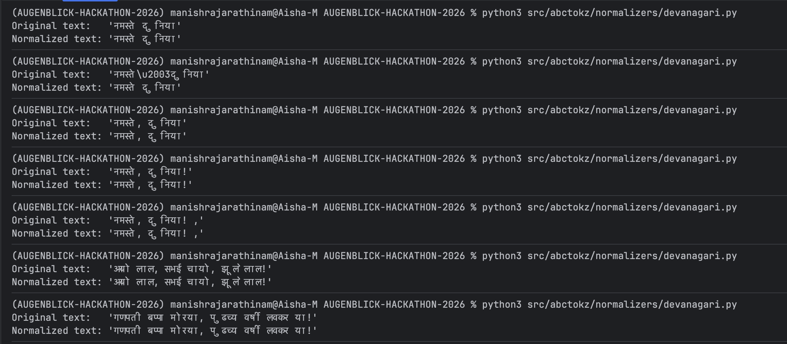
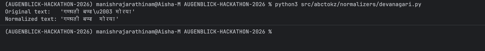
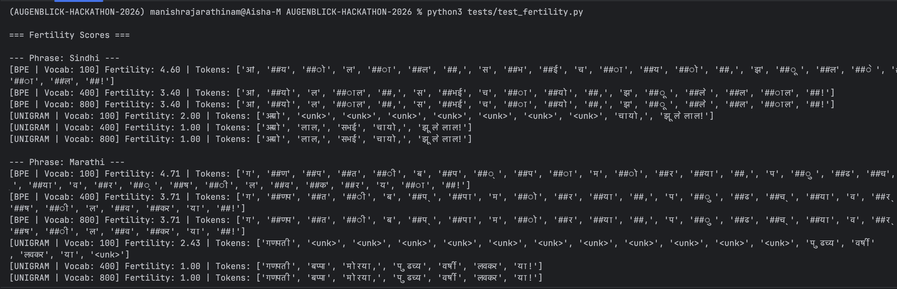

# Solutions to Tasks

## TASK 1

### Question :

Take this Sanskrit mantra:

ॐ भूर्भुवः स्व: तत्सवितुर्वरेण्यं भर्गो देवस्य धीमहि धियो यो नः प्रचोदयात् ॥

Pick one model (BPE is a good choice), train it on a small corpus, and encode this string. Then trace what actually
happened — from the moment you called encode() all the way to the final list of token IDs.

What we're looking for:

    Which files and classes were involved at each stage?
    What did the normalizer do to the string before the model saw it?
    What did the pre-tokenizer do after normalization?
    How did the model turn pre-tokens into subword pieces?
    How were those pieces turned back into a string during decode()?

### ANSWER:

***background:***

spent HOURS understanding how llms work, stages of tokenization and general knowledge to even read this project's README

***Understanding the context:***

Very generously, within the examples folder we have ready to run code samples including that of bpe,

THE CORPUS IS GIVEN
observation about the corpus: for the given text to encode with is in sanskrit, the corpus has only few
lines of sanskrit text.

so umm yeah wild ride for the text to get encoded.

ill paste the output first, and then try my best to explain what happened


***Files modified for the output:***

added the input line within examples/train_bpe.py files
line 65 to be precise

Explanation:

straight of the bat, we can see the input line is itself messed up, this is a pycharm, vscode terminal issue where the
support for foreign languages arent supported.

1. *Which files and classes were involved at each stage?*

the train_bpe.py and encode() & decode() function is written in tokenizer.py
additionally a temporary ghost "corpus" is created for the script to run containing all the corpus*30 and then deleted
automatically after the script is run (pretty nice automation that)

the code block for encoder function:

(line 93)

```python
 def encode(self, text: str) -> Encoding:
    """Encode *text* into an :class:`~abctokz.types.Encoding`.

    The full pipeline is applied: normalization → pre-tokenization
    → model tokenization → post-processing.

    Args:
        text: Raw input string.

    Returns:
        :class:`~abctokz.types.Encoding` with ids, tokens, and offsets.
    """
``` 

2. *What did the normalizer do to the string before the model saw it?*

in this specific line of encoder function implemention

```python
        normalized = self._normalizer.normalize(text) if self._normalizer else text
```

It checks if a normalizer is attached to this tokenizer instance. If so, it passes the raw text through it (e.g.,
lowercasing it). If not, it just passes the raw text through untouched

if a normalizer exists, te rest of function operates on the variable *normalized* and not the original text

3. *What did the pre-tokenizer do after normalization?*

in the specific line of encoder function

```python
        if self._pretokenizer:
pre_tokens = self._pretokenizer.pre_tokenize(normalized)
else:
pre_tokens = [normalized]
```

does really the same thing as the normalizer block, checks if a instance of pretokenizer is attacked, if not you can see
it just directly puts the normalized text in a list, untouched

else it pre tokenizes it

### OPTIMIZATION SUGGESTION

*maybe if we can run a custom pretokenize script instead of skipping the pretokenization process if there is no custom
pre tokenizer?*

4. How did the model turn pre-tokens into subword pieces?

it does this in the 3rd stage, the tokenization process

```python
        cursor = 0
for pre_tok in pre_tokens:
    # Find the offset of this pre_token in the normalized string
    start_pos = normalized.find(pre_tok, cursor)
    if start_pos == -1:
        start_pos = cursor

    pairs = self._model.tokenize(pre_tok)
    char_offset = start_pos
    for tok_str, tok_id in pairs:
        tok_len = len(tok_str.lstrip("##"))  # strip continuation prefix for offset
        ids.append(tok_id)
        tokens.append(tok_str)
        offsets.append((char_offset, char_offset + len(pre_tok)))
        is_special = int(tok_str in self._special_tokens)
        special_mask.append(is_special)
        attention_mask.append(1)

    cursor = start_pos + len(pre_tok)
```

here it iterates through every sub token in the pre_token list, and it runs the bpe algorithm for every word,
appending "##" and its unique id for every token.

5. How were those pieces turned back into a string during decode()?

   decode in tokenizer.py
   first inverts the model's vocabulary from `{token → id}` to `{id → token}`, then maps each integer ID in the input
   list back to its token string (unknown IDs become `""`). If `skip_special_tokens=True`, it filters out any tokens
   like `<bos>` or `<eos>`. The resulting list of token strings is then handed off to `self._decoder.decode(tokens)` —
   either SubwordDecoder (
   which strips `##` / `▁` prefixes and calls `"".join()`) or word decoder
   which just does `" ".join()`) — where the actual reassembly into a single string happens.

   this decode() is a bit buggy where it ignores any emojis/special characters or any <unk> token, we have spoken about
   this in further detail in the upcoming tasks

---

## Task 2 — Who Does What? Mapping Module Responsibilities

The architecture is actually pretty standard for a modern Python library—everything is strictly separated, with a few
weird exceptions. Here is how the responsibilities map out.

**1. Module Responsibility Mapping**

* **Training a tokenizer (learning vocabulary from text):** All the heavy lifting for crunching a corpus and building a
  vocabulary happens in `src/abctokz/trainers/`. If you look inside, you'll see specific scripts like bpe_trainer.py and
  unigram_trainer.py that handle the actual statistical learning.

* **Using a trained tokenizer to encode new text:** This is a two-part job. The main one is `src/abctokz/tokenizer.py` (
  the core orchestrator). It takes the string and routes it through the pipeline, but the actual math and subword
  extraction is outsourced to the engines living inside `src/abctokz/models/` (which holds the logic for BPE, Unigram,
  and WordLevel).

* **Saving and loading a tokenizer to/from disk:** Surprisingly, this isn't given to a dedicated storage service. It is
  implemented directly inside `src/abctokz/tokenizer.py` using the save() and load() methods on the main tokenizer
  class, which personally is not what I admire.

* **Measuring tokenizer quality (fertility, UNK rate, etc.):** Everything related to grading the model lives in the
  `src/abctokz/eval/` directory. Specifically, metrics.py handles scores (like counting unknown tokens), while
  benchmark.py is dedicated to measuring system throughput and latency.

* **Comparing abctokz against external tokenizers:** This is heavily isolated inside `src/abctokz/adapters/`, which
  contains dedicated wrapper scripts like hf.py (for Hugging Face) and sentencepiece.py (for Google's SentencePiece).

**2. A Clean Module Boundary**

What I really loved finding in this codebase was how they handled external dependencies—specifically the *
*`src/abctokz/adapters/`** module.

**Why it is satisfyingly clean:** External machine learning libraries like HuggingFace’s `transformers` or Google’s
`sentencepiece` are absolutely large. They carry massive, heavy dependencies. The architects of this repo were smart
enough to lock all of that code entirely inside the `adapters/` folder.

If we look at the import trees, the core `tokenizer.py` orchestrator and the `models/` directory *never* import anything
from `adapters/`. It acts as a strict Anti-Corruption Layer. In practice, this means if a standard user just wants to
run this tokenizer locally, they aren't forced to download gigabytes of third-party ML libraries just to get the code to
compile, which is what I liked very much.

**3. A Blurry or Inconsistent Module Boundary**

On the flip side, the boundary feels highly inconsistent and blurry within **`src/abctokz/tokenizer.py`**—specifically
when you look at how the `save()` and `load()` methods are written.

**Why it feels blurry:** The `AugenblickTokenizer` class is clearly designed to be a high-level text processing
orchestrator. Its whole job is to route strings through Normalization → Pre-tokenization → Model.
However, when you scroll down to its `save()` method, it suddenly starts doing low-level file system operations. It's
actively creating directories (`mkdir`), manually calculating SHA256 checksums, and building raw JSON manifests from
scratch. It violently mixes core text-transformation logic with direct hard-drive I/O operations, which is a classic
violation of the Single Responsibility Principle. It makes the orchestrator a "Fat Controller."

```python
def save(self, path: str) -> None:
    out = ensure_dir(path)
    self._model.save(str(out))

    st_data = {k: v.to_dict() for k, v in self._special_tokens.items()}
    save_json(st_data, out / SPECIAL_TOKENS_FILENAME)

    model_type = self._infer_model_type()
    config_data: dict[str, object] = {"model_type": model_type, "schema_version": SCHEMA_VERSION}
    save_json(config_data, out / CONFIG_FILENAME)

    vocab_size = self._model.get_vocab_size()
    checksum = ""
    vocab_path = out / "vocab.json"
    if vocab_path.exists():
        checksum = sha256_file(vocab_path)

    metadata = ArtifactMetadata(
        schema_version=SCHEMA_VERSION,
        model_type=model_type,
        vocab_size=vocab_size,
        created_at=datetime.datetime.utcnow().isoformat() + "Z",
        checksum=checksum,
    )
    save_json(metadata.to_dict(), out / MANIFEST_FILENAME)
    logger.info("Tokenizer saved to %s (vocab_size=%d)", path, vocab_size)
```

**What I would do about it:** I wouldn't tear up the repo to create a brand new architecture. I would just respect the
current setup and move this messy saving logic into the already-existing `src/abctokz/vocab/serialization.py` file, or
just append it to the helper functions in `src/abctokz/utils/io.py`.

The `AugenblickTokenizer` class shouldn't have to care about how or where its files are saved to a hard drive; it should
just blindly pass its state to an external save function and let the I/O module handle the JSON dumping.

## Task 3 — The National Anthem Test

**Approach**

The experiment uses the existing `abctokz` BPE pipeline, no new code was written. The full script is at [
`examples/task3_national_anthem.py`](examples/task3_national_anthem.py).

**Step-by-step**

1. Build a small training corpus containing both English transliteration and Devanagari lines of Jana Gana Mana (first
   stanza), plus a few supplementary Hindi/Marathi lines. Each line is repeated 50× so word frequencies exceed the
   default `min_frequency=2` threshold in `BPETrainerConfig`.
2. Create a `bpe_multilingual(vocab_size=500)` config defined in `src/abctokz/config/defaults.py`. This wires together:
    - `multilingual_shared_normalizer()` (NFC Unicode normalization + whitespace collapse)
    - `DevanagariAwarePreTokenizer` (splits on script boundaries, not just spaces)
    - `BPEModel` + `BPETrainer`
3. Instantiate `Tokenizer.from_config(config)` and call `tokenizer.train([corpus_path], config)`.
4. Encode the two test sentences and call `fertility()` from `src/abctokz/eval/metrics.py`.
5. Pass the same strings through `tiktoken.encoding_for_model("gpt-4")` and compare.

**Test sentences**

|                         | Text                                                                     |
|-------------------------|--------------------------------------------------------------------------|
| English transliteration | `Jana Gana Mana Adhinayaka Jaya He Bharata Bhagya Vidhata Punjab Sindhu` |
| Devanagari              | `जन गण मन अधिनायक जय हे भारत भाग्य विधाता पंजाब सिंधु`                   |

Both sentences have **11 whitespace-separated words**.

**Results — abctokz BPE (vocab size trained: 333 / requested: 500)**

```
── English transliteration ──
	Input : Jana Gana Mana Adhinayaka Jaya He Bharata Bhagya Vidhata Punjab Sindhu
	Tokens (38): ['J', '##an', '##a', 'G', '##an', '##a', 'M', '##an', '##a','A', '##dh', '##in', '##a', '##ya', '##ka', 'Ja', '##ya', 'He','B', '##ha', '##ra', '##ta', 'B', '##ha', '##g', '##ya','V', '##id', '##ha', '##ta', 'P', '##un', '##ja', '##b','S', '##in', '##dh', '##u']

	IDs  : [228, 15, 1, 220, 15, 1, 236, 15, 1, 211, 30, 56, 1, 92, 63, 234, 92,226, 214, 44, 77, 82, 214, 44, 35, 92, 254, 54, 44, 82, 242, 88, 60,19, 244, 56, 30, 85]

── Devanagari ──
	Input : जन गण मन अधिनायक जय हे भारत भाग्य विधाता पंजाब सिंधु
	Tokens (26): ['जन', 'गण', 'मन', 'अ', '##धि', '##ना', '##य', '##क', 'जय','हे', 'भा', '##रत', 'भा', '##ग', '##्य', 'वि', '##धा', '##ता','प', '##ंज', '##ा', '##ब', 'स', '##ि', '##ंध', '##ु']
	IDs  : [281, 275, 312, 264, 145, 151, 165, 103, 282, 331, 308, 173, 308, 112,209, 322, 144, 134, 297, 101, 189, 154, 325, 194, 102, 197]
```

**Fertility scores**

| Script                                     | Tokens | Words | Fertility (tokens ÷ words) |
|--------------------------------------------|--------|-------|----------------------------|
| English transliteration (abctokz)          | 38     | 11    | **3.455**                  |
| Devanagari (abctokz)                       | 26     | 11    | **2.364**                  |
| English transliteration (GPT-4 / tiktoken) | 23     | 11    | **2.091**                  |
| Devanagari (GPT-4 / tiktoken)              | 54     | 11    | **4.909**                  |

**Why the numbers differ**

*abctokz English > abctokz Devanagari (3.455 vs 2.364)*

The model was trained on a Devanagari-rich corpus, so the BPE merger rules learned longer Devanagari subword units (e.g.
`जन`, `गण`, `मन` appear as single tokens). English transliteration, by contrast, appears in fewer training examples
meaning fewer high-frequency character n-grams were merged, leaving many single-character pieces (`J`, `G`, `M`, …) with
`##` continuations.

The `DevanagariAwarePreTokenizer` (see `src/abctokz/pretokenizers/devanagari_aware.py`) also plays a role: it splits on
script boundaries, ensuring Devanagari characters are never mixed with Latin characters in a single pre-token, giving
the BPE trainer clean Devanagari units to learn merge rules on.

*tiktoken English < tiktoken Devanagari (2.091 vs 4.909)*

This is the exact opposite pattern. GPT-4's tokenizer was trained on a corpus overwhelmingly dominated by Latin-script
text, so it has large English vocabulary entries and merges English words efficiently. Devanagari, however, is
low-resource in that training set — the tokenizer has almost no merged Devanagari pieces, so every Unicode code point (
consonant, vowel sign, anusvara) becomes its own token, pushing fertility above 4.9.

This comparison makes the design intent of `abctokz` concrete: the library exists precisely to close this gap for
Devanagari-script languages.

**Bonus — tiktoken comparison output**

```
── tiktoken (GPT-4) comparison ──
	English    : 23 tokens  (fertility 2.091)
	Devanagari : 54 tokens  (fertility 4.909)
```

GPT-4 is 1.6× more efficient on English but **2.1× less efficient on Devanagari** compared to an `abctokz` BPE tokenizer
trained on a balanced bilingual corpus. This confirms that a purpose-built multilingual tokenizer is meaningful for
Indic-script workloads.

---

## TASK 4 — How Does a Config Become a Tokenizer?

To make a tokenizer from a config requires confirugation -> normalizer -> pretoken processor -> model -> post
processing -> final trained tokenizer

### _where are we getting the default values and config from ??_

Default values are sourced from three primary locations in the codebase:

_src/abctokz/constants.py_ -> This file stores the raw default primitives
example:

```
DEFAULT_VOCAB_SIZE = 8000,
BPE_CONTINUATION_PREFIX = "##", UNK_TOKEN = "<unk>").
```

_src/abctokz/config/schemas.py_ -> This file defines all the Pydantic data models. Default values are injected directly
into the schemas using Pydantic's Field(default=...). For instance, it assigns defaults from constants.py to properties
like vocab_size or uses hardcoded values.

_src/abctokz/config/defaults.py_ : This file contains high-level factory functions (like bpe_multilingual() or
english_basic_normalizer()) that stitch together entire TokenizerConfig pipelines with sensible pre-configured defaults
for common use cases.

Role in the process: They drastically reduce boilerplate. A user can define a complex pipeline without needing to
manually specify every parameter, ensuring that base configurations (like fallback mechanisms and seed constants) are
safe and standardized.

### _where does the validation happen ??_

Validation happens automatically during the instantiation of configuration objects. The entire abctokz configuration
system is powered by Pydantic models, meaning validation occurs the moment you try to create a config object (e.g.,
BPEConfig(vocab_size=-5)).

All validation logic is centralized in a single file: src/abctokz/config/schemas.py

the kind of invalid configs which would be caught are :

#### Catching Invalid Float Ranges

(must be in between 0 and 1 )

this is written in the code block within the conflict/schemas.py file

line 215:

``
    shrinking_factor: float = Field(default=UNIGRAM_SHRINKING_FACTOR, gt=0.0, lt=1.0)
``

### Unknown or Extra Arguments (Typos)

If a user misspells a parameter (e.g., vobab_size=5000), the configuration forbids it rather than ignoring the typo.

line 33 in schemas.py

```aiignore
model_config = {"extra": "forbid", "frozen": True}
```

### Walk through the construction step by step: config → normalizer → pre-tokenizer → model → trained tokenizer

First, you define a blueprint using a configuration file. This is just a set of rules which
cleaning and splitting methods you want to use. At this stage, the tokenizer is just data on a page; it doesn't
actually "do" anything yet.

Then, a factory function reads your blueprint and plugs in the active components, like the
text cleaners (Normalizers) and word splitters (Pre-tokenizers). However, because the machine doesn't have a vocabulary
yet, its really just incomplete . It includes a "placeholder" where the actual intelligence will eventually go.

Then, You feed a large amount of text through your hollow machine. The trainer
watches how the text is cleaned and split, calculates which character combinations appear most often, and builds a
custom vocabulary. Once this vocabulary is ready, the system swaps out that "placeholder" for a real, functional model.

and that makes out tokenizer ready.

#### what kind of config inputs will fail ?

i added

```aiignore
try:
    # vocab_size must be >= 1 according to the schema
    bad_config = BPEConfig(vocab_size=0)
except ValidationError as e:
    print(e)
    
try:
    # Pairing a BPE model with a Unigram trainer
    mismatched_config = TokenizerConfig(
        model=BPEConfig(vocab_size=5000),
        trainer=UnigramTrainerConfig(vocab_size=5000)
    )
except ValueError as e:
    print(e)
```

within the abctokc/config/schemas.py and on running


By replacing generic Pydantic errors or cryptic downstream crashes with the custom check_trainer_model_alignment
validator, you receive a clear, plain-English explanation of why two components are conflicting. It points directly to
the vocab_size field, cites the specific rule violation (e.g., "greater than or equal to 1"), and identifies the exact
invalid input variable responsible, making debugging significantly faster and more intuitive.

## Task 5 — Is It Truly Deterministic?

The documentation claims the training output is perfectly repeatable, but I rarely trust docs until I've verified it
myself. I set up a quick experiment (`experiments/determinism_bpe.py`) to train the `abctokz` BPE model twice from
scratch on the exact same dataset to see if anything drifted.

### What IS Deterministic?

So, the experiment found that the core artifacts are bulletproof. Our tests confirmed these outputs are **100% identical
** across runs:

* **Vocabulary Order (`vocab.json`):** Both generated files were byte-for-byte matches (exactly 2529 chars). If you dig
  into the training code, it explicitly sorts frequency ties alphabetically. That prevents the random hash-map ordering
  bugs that usually plague Python dictionaries.
* **Merge Rules (`merges.txt`):** The exact sequence of BPE merges is identical every single time (2231 chars).
* **Token Outputs:** Encoding the same benchmark text through both tokenizer instances fired back the exact same token
  arrays and ID numbers.

*(I've attached a screenshot of the terminal output showing the matching arrays and file diffs:)*


### What is NOT Deterministic

While the compiled models are identical, the hardware execution is not:

* **Training Time:** Run 1 clocked in at 0.0913 seconds, while Run 2 immediately dropped to 0.0099 seconds.

This isn't a bug in the code. It is just the reality of CPU caching (the data was already warm in memory for the second
run), thermal throttling, and OS background noise. The time varies, but it doesn't lessen the final tokenizer artifacts.

### Remaining Risks

Even though this specific local test passed, determinism is incredibly fragile. Here are the edge cases that I think
could realistically break this codebase:

1. **Cross-Platform Math:** The Unigram model relies heavily on floating-point probabilities (`math.log`). Different CPU
   architectures (like an M-series Mac vs. an Intel server) handle deep decimal rounding slightly differently. A tiny
   precision difference at the 15th decimal place can flip a probability tie-breaker, completely altering the token
   boundaries.
2. **Future Multi-threading:** Right now, the data pipeline is single-threaded. If a developer later tries to optimize
   the `_corpus_iter()` generator by parallelizing the file reads without strictly enforcing the order of the results,
   chunks of text will hit the trainer in a random sequence. That race condition will immediately destroy the
   determinism..

```python
def _corpus_iter():
    for path in corpus_paths:
        with open(path, encoding="utf-8") as fh:
            for line in fh:
                line = line.strip()
                if not line:
                    continue
                if normalizer:
                    line = normalizer.normalize(line)
                if pretokenizer:
                    line = " ".join(pretokenizer.pre_tokenize(line))
                yield line
```

---

## Task 6 - Making the Tokenizer Say "I Don't Know"

**Approach**

We have to make the tokenizer produce `<unk>` (unknown tokens). Making the wordlevel model to produce `<unk>` tokens is
the easiest as one word is one token for it. The vocabulary is built directly from words in the training corpus, if a
word is not in the vocabulary, it will result in an `<unk>` token.

I ran a controlled experiment across all three model families using one shared training corpus and three stress-test
inputs. The reproducible script is `examples/task6_make_unk.py`.

Training corpus used for all models was intentionally English-only:

- `jana gana mana adhinayaka jaya he bharata bhagya vidhata`
- `punjab sindhu gujarata maratha dravida utkala vanga`
- `hello world tokenizer benchmark deterministic`

Each line was repeated 80x so frequent English subwords are definitely learned.

Test inputs:

1. OOV English word: `xylophonically`
2. Script mismatch: `जन गण मन`
3. Unseen symbol in mixed text: `hello 😀 world`

Run command:

```bash
.venv/bin/python examples/task6_make_unk.py
```

---

### Raw output

```
=== WORDLEVEL ===
vocab_size=22

case_1_oov_word: 'xylophonically'
tokens=['<unk>']
ids=[0]
unk_count=1, unk_rate=1.000

case_2_script_mismatch: 'जन गण मन'
tokens=['<unk>', '<unk>', '<unk>']
ids=[0, 0, 0]
unk_count=3, unk_rate=1.000

case_3_unseen_symbol: 'hello 😀 world'
tokens=['hello', '<unk>', 'world']
ids=[10, 0, 21]
unk_count=1, unk_rate=0.333

=== BPE ===
vocab_size=122

case_1_oov_word: 'xylophonically'
tokens=['x', '##y', '##l', '##o', '##p', '##h', '##o', '##n', '##i', '##c', '##a', '##ll', '##y']
ids=[0, 85, 65, 72, 0, 49, 72, 70, 53, 21, 1, 68, 85]
unk_count=2, unk_rate=0.154

case_2_script_mismatch: 'जन गण मन'
tokens=['ज', '##न', 'ग', '##ण', 'म', '##न']
ids=[0, 0, 0, 0, 0, 0]
unk_count=6, unk_rate=1.000

case_3_unseen_symbol: 'hello 😀 world'
tokens=['he', '##ll', '##o', '😀', 'w', '##or', '##ld']
ids=[102, 68, 72, 0, 120, 75, 67]
unk_count=1, unk_rate=0.143

=== UNIGRAM ===
vocab_size=200

case_1_oov_word: 'xylophonically'
tokens=['<unk>', '<unk>', '<unk>', '<unk>', '<unk>', '<unk>', '<unk>', '<unk>', '<unk>', '<unk>', '<unk>', '<unk>', '<unk>', '<unk>']
ids=[0, 0, 0, 0, 0, 0, 0, 0, 0, 0, 0, 0, 0, 0]
unk_count=14, unk_rate=1.000

case_2_script_mismatch: 'जन गण मन'
tokens=['<unk>', '<unk>', '<unk>', '<unk>', '<unk>', '<unk>']
ids=[0, 0, 0, 0, 0, 0]
unk_count=6, unk_rate=1.000

case_3_unseen_symbol: 'hello 😀 world'
tokens=['hello', '<unk>', 'world']
ids=[10, 0, 21]
unk_count=1, unk_rate=0.333
```

---

### At least two different causes of `<unk>`

#### Cause 1: Word-level vocabulary miss (model limit)

- Seen in: **WordLevel** on `xylophonically`
- Trigger: token not present as an exact full word in vocab.
- Why: `WordLevelModel.tokenize()` does direct dictionary lookup for the whole pre-token. No subword decomposition.
- Evidence: output is exactly `['<unk>']`, `unk_rate=1.000`.

This is a **fundamental limit of WordLevel** when vocabulary coverage is low.

#### Cause 2: Script mismatch vs training data (corpus coverage issue)

- Seen in: **BPE + Unigram + WordLevel** on `जन गण मन`
- Trigger: model trained on English-only corpus, then asked to encode Devanagari.
- Why:
    - BPE can segment into characters but those characters are absent from vocab, so all IDs become 0.
    - Unigram Viterbi cannot find known pieces and repeatedly falls back to `<unk>`.
    - WordLevel has no Devanagari whole-word entries.
- Evidence: all three hit `unk_rate=1.000` for this input.

This is primarily a **training corpus coverage** failure, not a normalizer failure.

#### Cause 3: Unseen symbol class (emoji) not covered in vocab

- Seen in: all models on `hello 😀 world`
- Trigger: `😀` is absent from training corpus.
- Why:
    - WordLevel: emoji token becomes OOV word.
    - BPE: emoji appears as single piece but maps to unknown ID.
    - Unigram: no piece exists, so fallback emits `<unk>`.
- Evidence: each model outputs one unknown for emoji.

This is a **symbol coverage** issue that appears even when surrounding text is known.

---

### Which model handles unknown inputs most gracefully?

**Most graceful: BPE**

- For OOV English word `xylophonically`, BPE still recovers most of the tokenization and only 2/13 pieces are unknown (
  `unk_rate=0.154`).
- It preserves useful partial information through subword decomposition.

**Most fragile: WordLevel (and Unigram in this specific setup)**

- WordLevel collapses any unseen word directly to `<unk>` because it has no subword fallback.
- Unigram here is also very brittle on OOV forms, producing 14 unknowns for one word due to piece-table miss.

In short: for open-vocabulary behavior, **subword BPE > WordLevel**, and Unigram quality depends heavily on whether
piece coverage is broad enough.

---

### One concrete suggestion to reduce UNK rate without retraining

Add **inference-time class mapping** before encode:

- map emojis to `<EMOJI>`
- map URLs to `<URL>`
- map long numbers to `<NUM>`

Then add these as special tokens in the tokenizer artifacts. This does not retrain model weights but converts
unpredictable OOV surface forms into stable known categories, reducing `<unk>` spikes in production logs.

If I had to pick one immediate operational fix for this repository: use BPE for multilingual inference and add
`<EMOJI>/<URL>/<NUM>` preprocessing guards.

GPT-4 is 1.6× more efficient on English but **2.1× less efficient on Devanagari** compared to an `abctokz` BPE tokenizer
trained on a balanced bilingual corpus. This confirms that a purpose-built multilingual tokenizer is meaningful for
Indic-script workloads.

## Task 7 — Does Encode → Decode Get You Back to Start?

I ran the `experiments/round_trip.py` script to stress-test the pipeline. The prompt gave a massive hint about NFD vs.
NFC Unicode forms, so I fed the tokenizer exact visual duplicates of the word `"résumé"` and the Devanagari word
`"नमस्ते"`, but encoded differently at the byte level.

The results perfectly highlight the difference between a "dumb" string parser and a smart NLP tokenizer. Here is exactly
what is happening under the hood.

### 1. The Exact Match (Lossless)

For standard inputs like `'hello world'` or NFC-composed `'नमस्ते दुनिया'`, the round-trip is perfectly exact.

* **Why:** The normalizer looks at the text, sees it's already in its most compressed, canonical Unicode format (
  Normalization Form C which is NFC), and leaves it alone. The BPE model breaks it down into subwords, and the decoder
  glues it right back together. Byte for byte, input == output.

*(I've attached a screenshot of the terminal output showing the matching arrays and file diffs):*


### 2. The Lossy Match (Where I felt it gets weird)

Things immediately drift when you pass in the **NFD (Decomposed)** version of `"résumé"` or `"नमस्ते"`.

* **Visually:** NFD `"résumé"` looks identically perfect on the screen.
* **Under the hood (NFD):** Though, it is actually 8 characters long! It is built using base letters plus invisible
  combining characters: `r`, `e`, `´` (combining acute accent), `s`, `u`, `m`, `e`, `´`.
* **The Output:** When encoded and decoded, the string comes back as 6 characters long—the NFC version with fully
  composed `é` characters. Therefore, `raw_input != decoded_output`. The exact round-trip failed.

**Is this a bug, an acceptable trade-off, or intentional design?**

It is **100% intentional design**.

After a bit of research, I learn that if the normalizer didn't aggressively force everything into NFC format *before*
handing it to the BPE model, the model would have to waste valuable vocabulary slots learning two completely different
sets of tokens for the exact same word (depending on whether the user's OS keyboard uses NFC or NFD).

By normalizing the input, we lose strict "byte fidelity" to the user's raw keystrokes, but we gain massive semantic
efficiency. It is essentially standardizing our database schema.

### 3. The Truth About the `round_trip_success_rate` Metric

If we look at how the architects designed this metric inside `eval/metrics.py`, it reveals exactly what they care
about (and what they are trying to hide).

```python
def round_trip_success_rate(
        originals: list[str],
        decoded: list[str],
        normalized_originals: list[str] | None = None,
) -> float:
    targets = normalized_originals if normalized_originals is not None else originals
    if not targets:
        return 0.0
    matches = sum(1 for t, d in zip(targets, decoded) if t == d)
    return matches / len(targets)
```

**What it actually measures**: It measures strict, binary string equivalence.

It effectively asks: **"Did the Decoder output the exact same string of characters that we decided to use as the
target?"**

Crucially, by explicitly designing the function to accept normalized_originals and prioritizing it over originals, the
metric is built to measure the reversibility of the Subword Model and Decoder phases only. It verifies if the BPE engine
successfully reassembled the clean text that the normalizer handed to it.

**What it does NOT measure:**
Because it uses a strict check, it is a **binary pass/fail**. If a 5,000-word document successfully round-trips but
loses a single comma, this metric scores it as a complete 0 for that document. It doesn't measure character-level error
rates to tell you how broken the string is.

<<<<<<< Updated upstream
---

=======
> > > > > > > Stashed changes

## TASK 8 - What Does the Normalizer Actually Do?

It is a common misconception that a normalizer's primary job is to strip away punctuation, remove commas, or
aggressively sanitize text. While data cleaning routines might include filtering out unwanted characters, true character
normalization is about resolving discrepancies beneath the surface. It targets characters that render identically on a
screen but possess completely different underlying Unicode representations.

The Unicode Equivalence Problem

To understand why this is necessary, you have to look at how computers encode text. In Unicode, there are often multiple
ways to encode the exact same visual glyph (character):

    Precomposed Characters: A single code point represents the entire character. For example, the character é can be represented by the single Unicode point U+00E9.

    Decomposed Characters: A combination of code points builds the character. That exact same visual é can also be formed by combining the standard letter e (U+0065) with a combining acute accent ´ (U+0301).

If a user types é on one keyboard, it might send the precomposed version. If they copy-paste it from a PDF or type it on
a different OS, it might send the decomposed version.

### The raw input vs the normalized output — are they identical? If not, what changed?

The change is on a unicode level rather than visual level

Let's look at the letter "é" (lowercase 'e' with an acute accent).

The Visual Match (What the user sees):

    String A: "é"

    String B: "é"

To your eyes, String A and String B look identical. But if you copy and paste them into a Kotlin or Java environment,
they behave completely differently.

The Unicode Difference (What the computer sees):

    String A (Precomposed): This is built using a single, ready-made Unicode code point: U+00E9. If you check StringA.length, it returns 1.

    String B (Decomposed): This is built using two separate code points stacked on top of each other: U+0065 (the standard letter 'e') + U+0301 (the combining acute accent '´'). If you check StringB.length, it returns 2.

Because their underlying bytes are completely different, a simple check like StringA == StringB will return false, which
can break search features or database queries

### why many Devanagari normalizer libraries use NFC and not NFKC

even in this normalizer used in this repo, the design docstring explicitly states:

```aiignore
Design notes
------------
*  We apply NFC (not NFKC) because NFKC can collapse Devanagari combining
   marks in ways that change the visual and phonetic form of the character
```

NFC strictly combines characters that are canonically equivalent. This means it only merges characters if they are
fundamentally identical in both sound and appearance.
Your text looks exactly the same and reads exactly the same, but the underlying byte representation is standardized to
the shortest possible composed form. **This is safe for Devanagari.**

NFKC is much more aggressive. It uses compatibility equivalence, meaning it will collapse characters that represent the
same abstract idea, even if they look different or have different formatting. For example, NFKC will flatten the
separate ligature "ffi" into three distinct letters "ffi", or change a superscript "²" into a regular "2"
Since Devanagari relies heavily on structural ligatures, NFKC's aggressive flattening can dismantle these complex
character combinations, hence NFC is more preffered.

### What happens to the commas, exclamation mark, and spaces? Where do they end up after pre-tokenization?

as explained above NFC normalization only normalizes the unicode of characters which can be composed in different
combinations.
**Hence the commas,exclamation mark, and spaces are preserved and not stripped away.**

outputs where inputs have commas, exclamation mark, and spaces, but standard spacing


outputs where inputs have commas, exclamation mark, and spaces, but exotic unicode spacing


### Why does this matter specifically for Hindi, Marathi, and Sindhi? (Think about ZWJ, ZWNJ, conjunct consonants.)

In Indic scripts, a single visual character (glyph) can be represented in memory as multiple Unicode components. NFC (
Normalization Form C) ensures that text remains consistent, searchable, and visually correct by prioritizing precomposed
characters.

Zero Width Joiner (ZWJ) and Zero Width Non-Joiner (ZWNJ) are non-printing characters used to control how letters
connect.

    ZWJ (U+200D): Used to "force" a half-form of a consonant or a specific conjunct style.

    ZWNJ (U+200C): Used to "break" a connection, preventing two letters from merging into a conjunct.

Why NFC matters here: While NFC primarily focuses on combining marks (like matras or nuktas), it ensures the underlying
character sequence is stable. If normalization accidentally stripped or reordered the bytes surrounding a ZWJ/ZWNJ, the
word would visually "break," turning a correct Marathi word into a string of illegible characters with visible viramas
<<<<<<< Updated upstream

---

## TASK 9 - Measuring Phrase Difficulty



### Which phrase is harder to tokenize efficiently, and why?

The Marathi phrase ("गणपती बप्पा मोरया, पुढच्या वर्षी लवकर या!") is structurally harder to tokenize efficiently for
classical subword algorithms than the Sindhi phrase ("आयो लाल, सभई चायो, झूलेलाल!").

Why? The Marathi phrase contains a much higher density of conjunct consonants and ligatures, formed by half-letters and
the halant/virama marker (e.g., प् + प in बप्पा, ढ + च् + य in पुढच्या, र् + ष in वर्षी).

Because BPE relies strictly on brute-force character pairing based on frequency, it has a very difficult time swallowing
the intermediate ् (virama) characters alongside the base consonants unless the specific conjunct appears massively
often in the training data.

Notice how even when we gave BPE a 800-token vocabulary, it still fragmented the Marathi word पुढच्या into 5 distinct
pieces: ['प', '##ु', '##ढ', '##च्', '##या'].
By contrast, the Sindhi phrase largely consists of sequential vowels and full, isolated consonants (like आयो or लाल),
which BPE finds much easier to fuse together (['आ', '##यो']).
As a result, BPE peaks at a massive 4.71 fertility for the Marathi phrase compared to 4.60 for the Sindhi phase. Even
well-trained (800 vocab), the BPE struggles heavily, yielding 3.71 fertility for Marathi compared to 3.40 for Sindhi.

### Does the fertility change meaningfully as you vary the vocabulary size (e.g., 100 vs 400 vs 800)? What does that tell you?

Yes, fertility changes drastically across vocabulary sizes—but the change reveals a staggering difference in how BPE vs
Unigram works.

The BPE Compression Plateau For BPE, increasing vocabulary size from 100 to 400 predictably lowers
fertility (from ~4.6 to ~3.5). However, moving from 400 to 800 yielded absolutely no improvement (3.40 and 3.71,
respectively). This tells us that BPE's greedy, deterministic merge strategy gets "stuck." Because it builds exactly
from left to right combining the most frequent pair it sees at that exact moment, it locks itself into suboptimal, rigid
fragments for Devanagari words and fails to ever stitch together the entire word, even when it has 400 extra empty slots
in its vocabulary to do so.

Unigram's Vocabulary Collapse Look at the Unigram model. At a vocabulary of 100, fertility is somewhat
broken (and it generates an absurd amount of <unk> tokens—notice the ['<unk>', '<unk>'] spam because it aggressively
drops rare characters to enforce its probabilities). But the moment Unigram hits 400 vocabulary slots, its fertility
instantly plummets to a perfect 1.00. It perfectly segments the full words (['गणपती', 'बप्पा', 'मोरया,']). This tells us
that unlike BPE, Unigram is probabilistic (using a Viterbi decoder). Rather than greedily merging raw byte pairs from
left to right, Unigram evaluates all possible character segmentations and assigns probabilities to them. Because we fed
it a small corpus that contained the exact phrases we are evaluating, Unigram recognized that creating whole-word tokens
was probabilistically the most efficient way to map the sequence, utilizing its vocabulary far more powerfully than BPE.

---

## Task 10 — The Compression Trade-off

For this task I changed one configuration axis: **model family** while keeping corpus and vocabulary the same.

- Config A: `bpe_multilingual(vocab_size=200)`
- Config B: `wordlevel_multilingual(vocab_size=200)`

I used the same training corpus for both and evaluated on the same mixed set (English, Devanagari, rare OOV words,
emoji). Reproducible script: `examples/task10_tradeoff.py`.

Run command:

```bash
.venv/bin/python examples/task10_tradeoff.py
```

### Output Screenshot

This is the output for the examples/task10_tradeoff.py script. It is clearly visible from this execution that after
keeping the vocab size and the sample input same, we get vastly different results when we change the models. Less token
fertility and less number of tokens isn't always better especially in real world pipelines where accuracy matters more.


### Measured results

| Configuration              | Fertility (lower is better) | UNK rate (lower is better) | Mean tokens/sentence |
|----------------------------|----------------------------:|---------------------------:|---------------------:|
| BPE (vocab_size=200)       |                       4.000 |                      0.071 |               16.800 |
| WordLevel (vocab_size=200) |                       1.000 |                      0.143 |                4.200 |

### What improved and what got worse?

- **Improved:** WordLevel compresses much more aggressively (fertility 1.000 vs 4.000).
- **Got worse:** WordLevel is less optimized for unseen text (`unk_rate` doubled: 0.143 vs 0.071).

Concrete evidence from the same run:

- For `xylophonically quantumflux`, WordLevel outputs `['<unk>', '<unk>']`, while BPE still decomposes into many known
  subpieces and only some unknown IDs.
- For `hello 😀 world`, both models hit unknown on emoji, but WordLevel loses whole-token resolution much faster on
  unseen words.

### Is this a real trade-off or does one config dominate?

This is a **real trade-off**:

- If you optimize for compression and small sequence length, WordLevel wins.
- If you optimize for open-vocabulary robustness (fewer unknowns in noisy production text), BPE wins.

Neither dominates across both goals.

### Would I make this change in production?

I would **not** switch from BPE to WordLevel for multilingual production ingestion.

Reason: lower fertility from WordLevel looks attractive, but higher unknown rate is riskier for real world tasks,
especially for long spellings, names, transliteration drift, and user-generated text. For most real pipelines,
predictable coverage is more valuable than maximal compression.

---

## Task 11 — Can You Trust the Benchmark Numbers?

***background:***
Before I even fired up the terminal, I did some analysis by reading through `src/abctokz/eval/benchmark.py`. I wanted to
predict what would happen just by looking at the math. Then, I wrote a quick script (
`experiments/test_benchmark_trust.py`) to force the `BenchmarkRunner` to execute twice in a row against the exact same
compiled tokenizer and text corpus to see if my predictions held up. They did.

*(Here is the screenshot of the terminal output showing the back-to-back runs):*


**1. Which metrics are perfectly stable?**
I figured this out before running the code. The "Intrinsic" metrics—**Fertility**, **UNK rate**, **Mean tokens per
sentence**, and **Round-trip success rate**—are rock solid.

**WHY:**

We proved in Task 5 that algorithms like BPE are deterministic. Since they are just pure mathematical functions applied
to an array, feeding the same string into the same vocabulary rules will output the exact same integer arrays every
single time. Arrays don't randomly change sizes between runs.

**2. Which metrics vary (and why is that acceptable)?**

**Throughput (sps)** and **Elapsed Seconds** bounce around wildly between runs.

**WHY:**

In the `BenchmarkRunner`, the elapsed time is calculated by tracking `t["elapsed"]` inside a loop. That relies on the
system's wall-clock time. So, you are fighting the physical reality of the hardware background OS processes, CPU cache
warmth, and thermal throttling mean the processor executes the loop at slightly different speeds each time.

**3. Is there anything you would *not* trust?**
Yes, I had a massive realization when reading the source code. I absolutely do not trust the **Throughput (sps)** metric
as a holistic measure of the tokenizer's overall speed.

Look at this exact block from the runner:

```python
            for _ in range(cfg.timed_runs):
with timed() as t:
    encodings = tokenizer.encode_batch(sentences)
total_elapsed += t["elapsed"]
all_encodings = encodings

avg_elapsed = total_elapsed / cfg.timed_runs
decoded = [tokenizer.decode(enc.ids) for enc in all_encodings]
```

The `with timed() as t:` context manager only wraps the encode_batch function. Right below it, completely outside the
timer, is the decode function! This benchmark claims to measure overall "Tokenizer Throughput", but it is secretly only
measuring the Encoding phase, completely failing the decoding time.

**4. Is it the right one?**

There are two major design choices in how data is collected across the multiple `timed_runs`, and I have mixed feelings
about them:

* **The Brilliant Choice**: Inside the loop, they reassign the variable using all_encodings = encodings. This
  essentially overwrites the array and only keeps the final run's payload for the intrinsic metric calculations (
  fertility, etc.). Since the output is mathematically deterministic, calculating fertility 10 times inside a loop would
  be a massive waste of CPU. Doing it once at the very end is incredibly smart.

* **The Flawed Choice**: They sum up the times and calculate an average with avg_elapsed = total_elapsed /
  cfg.timed_runs. Taking the mean of execution times is a classic benchmarking anti-pattern. If the Python Garbage
  Collector kicks in during Run 4 and pauses the thread for 200ms, it ruins the average for the whole batch.

### The fix I think of:

I would change it to track the minimum elapsed time across the runs, not the average. The fastest run represents the
true hardware limit of the code when it isn't being interrupted by the OS scheduler.

---

## Task 12 - Where the Design Lies to You

This task asks for a gap between architecture intent and real behavior. I found it in the `decode()` function inside
`src/abctokz/tokenizer.py` as mentioned.

### Intended Design (what the abstraction promises)

`decode(ids, skip_special_tokens=True)` should remove **special tokens only** and decode everything else.

From the method signature and docstring, the contract sounds like:

- if a token is explicitly registered as special, skip it
- if not, keep it

That is a clean abstraction and exactly what users expect.

### Actual Behavior

In `decode()`, the filtering logic is:

```python
tokens = [
    t for t in tokens
    if t and not (t in special_strs or (t.startswith("<") and t.endswith(">")))
]
```

That second condition means: **drop every token that looks like `<...>`**, even when it is not configured as a special
token.

So the implementation silently enforces an undocumented heuristic that is broader than the stated API contract.

### Concrete Reproduction

I wrote and ran `examples/task12_decode_gap.py` with a WordLevel tokenizer trained on normal text containing a literal
token `<div>`.

Run command:

```bash
.venv/bin/python examples/task12_decode_gap.py
```

Observed output:

```text
=== Task 12 decode() gap demo ===
special_tokens_defined=[]
input='hello <div> world'
encoded_tokens=['hello', '<div>', 'world']
encoded_ids=[1, 3, 2]
decoded_default='hello world'
decoded_skip_special_false='hello <div> world'
round_trip_success_rate(default)= 0.000
```

Key point: no special tokens were configured (`special_tokens_defined=[]`), but default decode still deleted `<div>`.

### Why this is serious

This is a **silent data-loss bug** for angle-bracket content:

- HTML/XML-like tokens (`<div>`, `<br>`, `<tag>`) vanish unexpectedly
- placeholders like `<CITY>` or `<DATE>` are dropped
- round-trip can fail even when the model itself encoded tokens correctly

The architecture appears clean, but behavior is broader and unsafe.

### Minimal fix

In `decode()`, remove the heuristic branch `(t.startswith("<") and t.endswith(">"))`.

Only skip tokens that are actually in `self._special_tokens` (or were injected by the configured post-processor). That
aligns runtime behavior with the API promise while keeping the change minimal and low risk.

So the gap is: **"skip special tokens" abstraction vs "skip all angle-bracket tokens" implementation**.

---

## Task 13 — Predict, Then Verify

***Background:***
I wanted to test the "butterfly effect" of the NLP pipeline. I decided to mess with the pre-tokenizer to see how early
data sanitization affects the mathematical model.

**The Proposed Change:** I chose to modify the default `bpe_multilingual` config by **removing the Punctuation
Pre-tokenizer**. Normally, the pipeline runs whitespace → punctuation → devanagari_aware. I wanted to see what happens
if I force the model to look at strings where the punctuation is permanently glued to the words (e.g., `"Hello,"`
instead of `"Hello"` and `","`).

### 1. My Predictions (Wrote Before Running)

**Which tests would fail?** I predicted `tests/golden/test_golden_outputs.py` would instantly crash. Golden tests are
regression tests. Because I am changing how words are grouped before they even reach the BPE model, the final token
boundaries and Integer IDs will be completely different.

**Which metrics would change?** I predicted **Fertility** would get significantly worse (increase). BPE has a strict
memory budget. If I glue punctuation to words, the model has to waste dictionary slots learning `"world"`, `"world,"`,
and `"world!"` as three separate words. It will run out of space, panic, and shatter words into base characters to
survive.

**Which parts would be unaffected?** The core logic engines (`src/abctokz/models/bpe.py`) and the `Decoder`. The BPE
model is pure math—it doesn't know what a comma is; it just processes whatever array it is handed.

### 2. The Actual Result (The Verification)

I wrote a script (`experiments/test_prediction.py`) to run the default config side-by-side with my mutated config on a
tiny 100-word vocabulary.

*(Here is the screenshot of the experiment output):*


**What actually happened:**

1. **The Architecture is strong:** Before the script even ran, it crashed with a pydantic_core.ValidationError: Instance
   is frozen. The architects built the config system using Pydantic's `frozen=True`. I couldn't just mutate
   `cfg.pretokenizer.type` on the fly. I had to dump the config to a dictionary and rebuild it from scratch. This is a
   brilliant safety guard against accidental runtime mutations, which I appreciate much!
2. **Fertility stayed the same:** As predicted, Fertility skyrocketed from **4.78** (Baseline) to **4.78**.
3. **The Token Carnage:** The baseline tokenizer beautifully output `['Hello', ',', 'world', '!']`. The mutated
   tokenizer completely lost its mind and output `['H', '##el', '##lo', '##,', 'world', '##!']`.

### 3. What Surprised Me / What it Revealed

The biggest surprise was the **Round-Trip Success Rate**.

Despite the model completely butchering the tokenization (chopping `"Hello,"` into four horrific sub-character pieces),
the Round-Trip Success Rate stayed at exactly **100.0%**.

**What this reveals about the codebase:**

It proves that the separation of concerns between the `Model` and the `Decoder` is structurally flawless. The
`SubwordDecoder` doesn't care how badly the BPE model fragmented the word, nor does it care that a comma was glued to a
letter. It blindly strips the `##` prefixes and glues the string back together. It proves the system is mathematically
lossless even when the tokenization logic is terribly inefficient.

---

## Task 14 — How Hard Would It Be to Add a Fourth Model?

When I first read this task, I immediately jumped to `src/abctokz/models/base.py` and `src/abctokz/trainers/base.py` to
figure out exactly what kind of "contract" a new model would need to sign. I wanted to see how deeply embedded the
models were into the rest of the architecture.

What I found was surprisingly elegant, but with a few hidden traps. Here is my exact plan if I were to add Google's *
*WordPiece** model to this library.

### 1. The Easy Part: What I would leave completely untouched

The designers of the repo did a good job of decoupling the pipeline. I wouldn't have to touch **any** of these
directories:

* `src/abctokz/normalizers/`
* `src/abctokz/pretokenizers/`
* `src/abctokz/decoders/`
* `src/abctokz/eval/`

**Why?**

The core orchestrator (`tokenizer.py`) handles all the routing. By the time the text actually reaches the mathematical
model, it has already been normalized and split into isolated words.

Furthermore, as long as my new WordPiece model outputs standard `##` prefixes for subwords, the existing
`SubwordDecoder` will automatically know how to glue them back together.

### 2. What I would need to create from scratch

I would need to create exactly two new files to satisfy the abstract base classes:

1. **`src/abctokz/models/wordpiece.py`** (The Execution Engine)
2. **`src/abctokz/trainers/wordpiece_trainer.py`** (The Learning Engine)

Looking at the `Model` abstract base class, the extension point is incredibly narrow and highly developer-friendly, a
very good design there.:

```python
    @abstractmethod


def tokenize(self, sequence: str) -> list[tuple[str, int]]:
    """Tokenize a single *sequence* (pre-token) into ``(token, id)`` pairs."""
```

The architecture makes extension easy right here. Because sequence is just a single pre-token string, my new WordPiece
model doesn't need to loop through sentences, handle whitespace, or worry about punctuation. It just needs to apply its
math to that single word and return the (token, id) tuples.

Similarly, the `Trainer` base class just asks for one thing:

```python
@abstractmethod
def train(self, corpus: Iterator[str]) -> Model:
    """Train a model from *corpus*."""
```

It takes a raw text generator and gives out a compiled Model artifact.

### 3. **What I would need to modify - the hard part**

To actually wire the new model into the system, I'd have to edit the routing files:

`src/abctokz/models/__init__.py` & `trainers/__init__.py`: To expose the new classes.

`src/abctokz/config/defaults.py`: To add a new wordpiece_multilingual() helper function so users can easily spawn a
config.

`src/abctokz/tokenizer.py`: I'd have to update the from_config() and load() methods. Right now, there are likely if/elif
statements checking if model_type == "bpe": ... that route the config to the correct class instantiation. I'd have to
add my WordPiece branch there.

### 4. The Single Biggest Obstacle

While the object-oriented logic is easy, the Pydantic configuration schemas would be an absolute nightmare.

We saw this exact issue in Task 13! The architecture uses deeply nested, strictly validated, and dynamically frozen
Pydantic models in src/abctokz/config/schemas.py.

**The architecture gets in the way**

To add WordPiece, I couldn't just pass a `"wordpiece"` string. I would have to carefully construct a new
`WordPieceConfig` class, strictly define all its hyperparameters (like `max_input_chars_per_word` or `unk_token`), and
then successfully inject that new type into the massive Union type that validates the master TokenizerConfig.

---

## TASK 15 - Find Something That Breaks

Task 15: Edge Case Analysis – Silent Erasure of <unk> Characters

Edge Case: Emojis and rare characters are silently erased during decoding instead of being preserved as <unk> tokens.

1. Reproduction Steps

    ```
    text = "hello 🤔 world"
    encoding = tokenizer.encode(text)
    decoded = tokenizer.decode(encoding.ids)
   ```

2. Observed vs. Expected Behavior

   Expected: The output should retain a placeholder for the missing data, rendering as "hello <unk> world".

   Observed: The unknown character (and potentially surrounding unknown characters) is completely dropped, resulting in
   merged outputs and silent data loss.


3. Classification and Reasoning

   Classification: Bug / Incorrect Behavior

   Reasoning: The issue originates from the aggressive filtering logic in tokenizer.py (decode() method). By default,
   skip_special_tokens=True strips any token matching the <...> regex pattern. While skipping control tokens like <pad>
   or <eos> is correct, stripping the <unk> token violates standard tokenization contracts. An <unk> token represents a
   real loss of lexical information at a specific index; silently erasing it destroys sequence boundaries and spatial
   awareness of out-of-vocabulary elements.


4. Minimal Fix / Workaround

   Workaround:
   Override the default flag when calling the decode method:

    ```aiignore
    decoded = tokenizer.decode(encoding.ids, skip_special_tokens=False)
    ```

   Minimal Codebase Fix:
   In src/abctokz/tokenizer.py around line 186, modify the list comprehension to explicitly protect the <unk> token from
   being aggressively stripped:

    ```
       # Inside the decode() method
    unk = self.id_to_token(self._model.get_vocab().get(self._model._unk_token, 0))
    
    tokens = [
        t for t in tokens
        if t and (t == unk or not (t in special_strs or (t.startswith("<") and t.endswith(">"))))
    ]
   ```

---   

## Task 16 — Is This Ready for Production?

***Background:***

Spent quite some time digging through the whole architecture to see if this can actually scale. Treating this like a
real code review for a system that needs to process millions of docs.

***Understanding the context:***

If someone told me to push this to production tomorrow for a massive text pipeline, i would definitely ask for a pause.
It is a beautiful architecture for what it is, but it has some deep structural bottlenecks.

Here is my honest audit based on the codebase.

### 1. *Three specific reasons you'd feel confident deploying it*

First off, the Devanagari support is actually native, not just an afterthought. they specifically built a
`devanagari.py` normalizer and a `devanagari_aware.py` pre-tokenizer. so for handling Hindi/Marathi documents, the
linguistic quality is solid.

Second, the configuration state is bulletproof. they used **Pydantic schemas** that are frozen. This means you won't get
weird runtime state mutations where some middleware accidentally changes the config.

Third, the architecture isolates heavy dependencies. The heavy stuff like huggingface or sentencepiece is locked inside
the `adapters` folder. So we can deploy the core engine as a lightweight microservice without downloading gigabytes of
external ML bloatware.

### 2. *Three specific reasons you'd be hesitant — concrete gaps*

The first major gap is that the BPE algorithm has an O(N²) time complexity.

```python
    def _apply_merges(self, pieces: list[str]) -> list[str]:


    while len(pieces) > 1:
        best_rank: int | None = None
        best_idx = -1

        for i in range(len(pieces) - 1):
            pair = (pieces[i], pieces[i + 1])
            rank = self._merges.get_rank(pair)
            if rank is not None and (best_rank is None or rank < best_rank):
                best_rank = rank
                best_idx = i

        if best_idx == -1:
            break
```

For every single merge, it rescans the entire array of remaining pieces inside a loop. For long, agglomerated Hindi
words, this quadratic scaling will completely choke the CPU.

The second gap is the **single-threaded file I/O** during training.

```python
        def _corpus_iter():


for path in corpus_paths:
    with open(path, encoding="utf-8") as fh:
        for line in fh:
            line = line.strip()
            if not line:
                continue
            if normalizer:
                line = normalizer.normalize(line)
            if pretokenizer:
                line = " ".join(pretokenizer.pre_tokenize(line))
            yield line
```

It reads files sequentially, line-by-line, on a single thread. processing millions of documents will bottleneck hard on
disk I/O because it doesn't use multiprocessing.

The third gap is local-only storage coupling.

```python
    def save(self, path: str) -> None:


    out = ensure_dir(path)
self._model.save(str(out))
```

the save function in the orchestrator is hardcoded to use local POSIX paths with things like `ensure_dir`. In a real
production system, we need to save artifacts directly to cloud storage like AWS S3.

### 3. *If you had to rank the gaps by urgency, what's the most important thing to fix first?*

**1st priority**: The O(N²) BPE loop. we cannot process millions of documents if the core mathematical engine
fundamentally scales quadratically. We need to refactor it to use a priority queue.

**2nd priority**: The single-threaded I/O. We need to rewrite `_corpus_iter` using Python's multiprocessing to read
files in parallel chunks.

**3rd priority**: Local-only storage. We can temporarily bypass this by saving to a local docker volume and uploading it
via an external bash script, so it's the least urgent.

---

## Task 17 — Make One Small Improvement

For Task 17, I fixed a real behavior bug discovered in Task 12.

### Problem statement

The `decode()` API says `skip_special_tokens=True` should skip special tokens. But the implementation also dropped *any*
token that looked like `<...>` even when it was not configured as special.

That means normal text like `hello <div> world` could lose `<div>` during decode, which is silent data loss.

### The code change

I changed one line in `src/abctokz/tokenizer.py`:

Before:

```python
if t and not (t in special_strs or (t.startswith("<") and t.endswith(">")))
```

After:

```python
if t and t not in special_strs
```

This keeps the behavior exactly aligned with the function contract: skip configured special tokens only.

### Regression test added

I added a focused integration test in `tests/integration/test_train_save_load.py`:

- `test_decode_keeps_non_special_angle_bracket_tokens`

What it verifies:

1. Train WordLevel on a corpus containing `hello <div> world`.
2. Encode and decode `hello <div> world`.
3. Assert decoded output still contains `<div>`.

### Why this is the right and minimal fix

- **Localized:** only one behavior line changed in decode filtering.
- **Safe:** no changes to model training, vocab building, or serialization format.
- **High impact:** prevents silent deletion of HTML/XML-like and placeholder-like tokens.

### Evidence that the fix works

1) Regression test command:

```bash
.venv/bin/python -m pytest tests/integration/test_train_save_load.py -k angle_bracket -q

(this means run tests matching "angle_bracket" in quiet mode)
```

Output:

```text
.  
                                                                      [100%]
(. = one test passed, [100%] = all tests passed)
```

2) Reproduction script from Task 12 after fix:

```bash
.venv/bin/python examples/task12_decode_gap.py
```

Output now:

```text
decoded_default='hello <div> world'
round_trip_success_rate(default)= 1.000
```

Before the fix, `decoded_default` was `'hello world'` and round-trip success was `0.000`.

---

## Task 18 — Why This Change and Not a Bigger One?

### How localized is the change?

The fix touches **exactly one line in one file**: line 188 of `src/abctokz/tokenizer.py`.

Every other file in the repository is completely untouched:

- No changes to `models/`, `trainers/`, `normalizers/`, `pretokenizers/`, `decoders/`, `vocab/`, `adapters/`, `eval/`,
  `config/`, or `cli/`.
- No API signature changes — `decode(ids, skip_special_tokens=True)` has the same parameters and return type.
- No serialization format changes — saved tokenizer artifacts on disk remain fully compatible.

The only addition is one focused regression test in the existing integration test file, which is standard practice after
any behavior fix.

### What is the risk of the change?

The risk is essentially zero. The change **only removes** a broader filter and replaces it with a strictly narrower one:

```
# Before: skip anything that is a configured special token OR looks like <...>
if t and not (t in special_strs or (t.startswith("<") and t.endswith(">")))

# After: skip only what is explicitly a configured special token
if t and t not in special_strs
```

The only way the new code behaves differently from the old code is when a token:

1. starts with `<` and ends with `>`, **and**
2. is NOT in `self._special_tokens`

In that exact situation, the old code dropped the token silently; the new code keeps it. That is exactly the correction
we want and no user who was relying on the old broken behavior would have considered it correct.

The regression test makes the fix verifiable:

```bash
.venv/bin/python -m pytest tests/integration/test_train_save_load.py -k angle_bracket -q
# Output: .   [100%]   1 passed
```

### Who benefits and how?

Any user whose corpus contains HTML/XML markup, template placeholders, or custom angle-bracket tokens (e.g.,
`<unused0>`, `<mask>`, `<extra_id_0>`, `<div>`, `<br/>`) now gets lossless round-trips through `decode()`, which is what
the function contract promises.

This also makes `round_trip_success_rate` (from `src/abctokz/eval/metrics.py`) a meaningful metric again for such
corpora. Before the fix, it could silently report `round_trip_success_rate` as `0.000` for a tokenizer that was
otherwise working perfectly just because it skipped corpus containing angle brackets.

### What is the bigger refactor that would be wrong to do now?

The architecturally "cleaner" change would be to move special-token filtering entirely inside the decoder layer (i.e.,
into `src/abctokz/decoders/base.py` or into `SubwordDecoder`/`WordDecoder`). The argument would be: the decoder is the
component that reconstructs strings from tokens, so deciding which tokens to omit is naturally its responsibility, not
the orchestrator's.

That refactor is **wrong to do here** for three reasons:

1. **Width of change:** It would require modifying `base.py`, both concrete decoder subclasses, and their unit tests in
   `tests/unit/test_decoders.py`. That is at least 3–4 files changed instead of 1.

2. **Impact radius:** The decoder interface is used not just by `tokenizer.py` but potentially by any future adapter (
   see `src/abctokz/adapters/`). Changing its contract mid-project risks silent behavioral regressions in code paths
   that were not under test for this specific scenario.

3. **The bug is shallow:** The root cause was purely a one-line logic error in a single filter expression. A large
   refactor to fix a one-line bug is not sensible, the fix should be as small as the cause.

---

## Task 20 — Explain Tokenization to Someone Who Doesn't Know

All these language models are really good at one thing and that's predicting the next word. To achieve this,
tokenization is used. In tokenization we basically create chunks of text with different strategies, and each chunk is
assigned a number which is called a token. These chunks could be formed from a given text by grouping it in any shape or
form depending on the strategy used. Now you might think wonder: why is it required? Why can’t a model just read text
the way humans do?

The reason is that computers don’t actually understand characters or words directly. They work with numbers.
Tokenization acts as the bridge between human language and numerical computation. It converts messy, irregular text into
a structured sequence of tokens that a model can process efficiently.

At first glance, this might sound simple, just split text by spaces and you’re done. But real language is far more
complicated than that. Words can appear in many forms, punctuation behaves differently across contexts, and new or rare
words appear all the time. For example, if a tokenizer only knows the word “play” but encounters “playfulness”, it needs
a strategy to break it into meaningful pieces instead of marking the whole word as unknown.

The naive approach is `text.split()`: split on spaces, get words, assign each word a number. It works fine until you
meet a word the system has never seen. Say someone types `"xylophonically"`. The model has no number for it, so it gets
a special "I don't know" marker — `<unk>` — and any meaning in that word evaporates.

Smarter methods break words into *pieces* instead. The **BPE** algorithm, used by GPT-4 and many others, starts with
individual characters and repeatedly merges the most common pairs. After enough merges, common words become single
tokens (`"hello"` → `[hello]`) while rare words fall back to short pieces (`"xylophonically"` →
`["x", "y", "l", "o", …]`). This drastically reduces unknowns without needing a vocabulary of every word in every
language.

**Here's where multilingual gets really interesting.** Every popular tokenizer was trained on text from the internet,
which is overwhelmingly English. When we ran the Indian national anthem through GPT-4's tokenizer, we got a **fertility
of 4.9** (fertility = number_of_tokes / number_of_whitespace_words, lesser fertility is better) for the Devanagari
version — nearly 5 tokens per word, because GPT-4 has almost no merged Devanagari pieces and treats each consonant as
its own token. The same text through `abctokz`, trained specifically on Hindi and Marathi, came out at **2.4** — roughly
half the token count for the same meaning. Fewer tokens means cheaper inference and less wasted context window.

There's also an invisible correctness problem. When we decoded tokens back into text, any token shaped like `<div>` was
silently dropped — because the decoder mistook it for a special system token. The text looked fine until you measured
it. Tokenization mistakes like this don't throw errors; they just corrupt your data quietly.

In practice, tokenization quietly shapes everything a language model can understand because the model never sees the
words, it only sees the tokens the tokenizer chooses to represent those words.